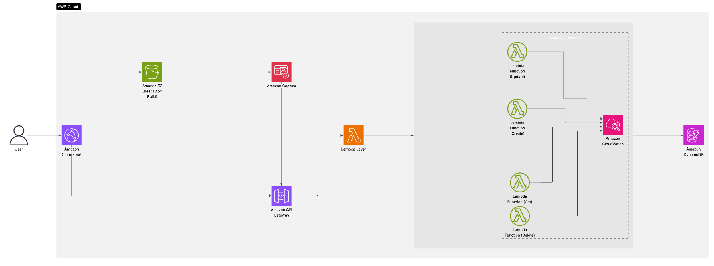

# AWS Serverless Todo Application

<p align="center">
  
</p>

A full-stack serverless Todo List application leveraging AWS Lambda, DynamoDB, API Gateway,AWS CloudFront AWS Cognito and a React frontend. This project demonstrates a robust CRUD (Create, Read, Update, Delete) workflow using scalable AWS serverless services.

## Architecture Overview

**Key Components:**

- **Frontend**: React.js SPA (Single Page Application)
  - Integrates with **Cognito** for user authentication
- **Cognito**: User authentication, linked to both Frontend and API Gateway for secure access
- **API Gateway**: RESTful API routing to Lambda functions
  - Secured by Cognito authorizer
- **Lambda Functions**: Stateless compute for CRUD operations
  - Uses a shared **Lambda Layer** for common utilities
  - Monitored by **CloudWatch** for logging and metrics
- **DynamoDB**: NoSQL database for todos
- **CloudFront**: CDN for fast delivery, routes traffic to both S3 (static frontend) and API Gateway (backend APIs)
- **S3**: Static website hosting for the frontend
- **CloudWatch**: Centralized logging and monitoring for Lambda and API Gateway

## Monitoring & Security

- **CloudWatch**: All Lambda API invocations are logged and monitored for performance and errors
- **Cognito**: Provides authentication for both the frontend and API Gateway, ensuring secure access to backend APIs

## Features

### 📝 Todo Management

- **Create** new todos with title, description, and priority
- **List** all todos
- **Edit** existing todos
- **Delete** todos
- **Set priority** levels (1, 2, 3...)
- **Mark** todos as completed or pending
- **Track** creation and update timestamps

### Data Model

Each todo item includes:

- `todoId`: Unique identifier (string/UUID)
- `title`: Todo title (**required**)
- `description`: Optional details
- `priority`: Priority level (integer)
- `completed`: Boolean status
- `createdAt`: ISO timestamp
- `updatedAt`: ISO timestamp

## Project Structure

```
├── Layers/
│   ├── LambdaFunctionsWithLayer/
│   │   ├── post/      # Create todo Lambda
│   │   ├── get/       # Read todos Lambda
│   │   ├── update/    # Update todo Lambda
│   │   └── delete/    # Delete todo Lambda
│   └── nodejs/        # Shared layer code (utilities)
├── frontend/          # React frontend with Cognito auth
└── policy/            # IAM & S3 policies
```

## API Endpoints

- `GET /todo` — Fetch all todos
- `GET /todo/{id}` — Fetch a specific todo
- `POST /todo` — Create a new todo
- `PUT /todo/{id}` — Update an existing todo
- `DELETE /todo/{id}` — Delete a todo

## Technology Stack

### Backend

- **AWS Lambda** — Stateless compute for API logic
- **Amazon DynamoDB** — NoSQL database
- **API Gateway** — REST API management
- **IAM** — Security and access control
- **Amazon Cognito** — Authentication and authorization

### Frontend

- **React.js** — UI framework
- **Vite** — Fast build tool
- **React Router** — SPA routing

### Dev Tools

- **Node.js** — Runtime
- **AWS SDK v3** — AWS integration
- **ESLint** — Linting

## Getting Started

### Prerequisites

- AWS Account
- Node.js 18+
- AWS CLI configured

### Backend Setup

1. Create and configure DynamoDB table
2. Deploy Lambda functions to AWS
3. Set up API Gateway:
   - Configure routes for all endpoints
   - Enable CORS for frontend access
   - Set up Cognito authorizer for protected routes
4. Set up Amazon Cognito User Pool and configure authentication (connect to both API Gateway and frontend)
5. Configure environment variables for Lambda
6. Set up CloudFront distribution to route traffic to both S3 (for static frontend hosting) and API Gateway (for backend APIs)

### Frontend Setup

1. `cd frontend/`
2. Install dependencies: `npm install`
3. Set up environment variables (see `.env.example` if available), including Cognito configuration
4. Build the frontend: `npm run build`
5. Upload the contents of the `dist/` folder to your S3 bucket
6. After each update, invalidate the CloudFront cache to reflect changes
7. (For local development) Start dev server: `npm run dev`
